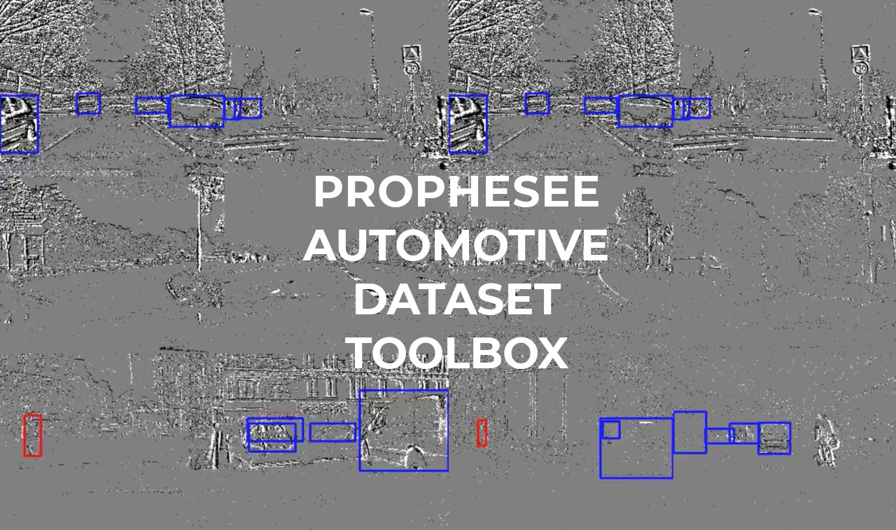

# Prophesee's Automotive Dataset Toolbox

[](https://www.youtube.com/watch?v=VJ7VSUqFvVE&feature=youtu.be) 

This repository contains a set of Python scripts to evaluate the Automotive Datasets provided by Prophesee.

## Requirements

The scripts can be launched with Python 2.x or Python 3.x:
* `io `   requires [NumPy](https://numpy.org/) 
* `visualize `   requires also [OpenCV](https://opencv.org/) with python bindings.

You can install all the dependencies using [pip](https://pip.pypa.io/en/stable/):
```
pip install numpy
pip install opencv-python
```

## Get the data

Go to the [dataset presentation page](https://www.prophesee.ai/2019/12/18/atis-automotive-detection-dataset/) and download the dataset (200G compressed and 750G uncompressed !).

The dataset is split into 10 archive files that can be independently used (2 for testing and validation sets each and six for training set)
Each archive contains up to 500 files and their annotations.

Unzip using [7zip](https://www.7-zip.org/).

If you use the dataset, please cite the article ["A Large Scale Event-based Detection Dataset for Automotive" by P. de Tournemire, D. Nitti, E. Perot, D. Migliore and A. Sironi](https://arxiv.org/abs/2001.08499)

## Visualization

To view a few files and their annotation just use
    `python3 dataset_visualization.py file_1_td.dat file_2_td.dat ... file_n_dat`
And it will display those events video in a grid. You can use it with any number of files, but a large number of them will
make the display slow!

## Reading files in python

There is a convenience class to read files that works both for the event .dat files and their annotations.
A small tutorial can be found [here](tutorial.ipynb)


## Running a baseline

Now you can start by running a baseline either by looking into [the last results in event-based literature](https://github.com/uzh-rpg/event-based_vision_resources) or by leveraging [the e2vid project](https://github.com/uzh-rpg/rpg_e2vid) of the University of Zurich's Robotic and Perception Group to run a frame-based detection algorithm!

## Evaluation using the COCO API

If you install the [API from COCO](https://github.com/cocodataset/cocoapi) you can use the provided helper function in `metrics` to get mean average precision metrics.
This is an usage example if you saved your detection results in the same format as the Ground Truth:
```python
import numpy as np
from src.metrics.coco_eval import evaluate_detection

RESULT_FILE_PATHS = ["file1_results_bbox.npy", "file2_results_bbox.npy"]
GT_FILE_PATHS = ["file1_bbox.npy", "file2_bbox.npy"]

result_boxes_list = [np.load(p) for p in RESULT_FILE_PATHS]
gt_boxes_list = [np.load(p) for p in GT_FILE_PATHS]

evaluate_detection(gt_boxes_list, result_boxes_list)
```
## Contacts
The code is open to contributions, so do not hesitate to ask questions, propose pull requests or create bug reports.
For any other information or inquiries, contact us [here](https://www.prophesee.ai/contact-us/)